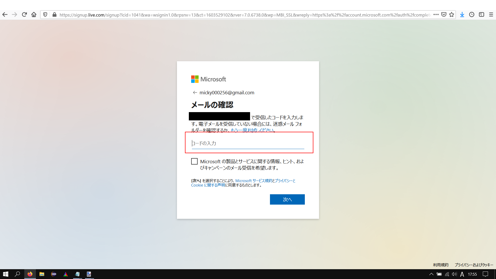

# Let's start Microsoft Teams !

( Oops!, this article is written in Japanese. )

マイクロソフトが提供しているファイル共有，テレビ会議などができる
コラボレーションアプリである"Teams"の始め方とつまづきやすいポイント，
しておくとよい設定項目とかを書いていきます．

 

## 目次

1. Microsoftアカウントを作ろう
2. Teamsをインストールしよう
3. しておくとよい設定項目
4. Zoomとの違い

 

## 1. Microsoftアカウントを作る

まず，マイクロソフトアカウントを作る必要があります．

**既にマイクロソフトアカウントを持っている方もいるかもしれませんが,ここで注意！！**

- 大学のメールアドレスでサインインはできますが，管理者は大学のため
自由にファイル共有をしたり，テレビ会議をしたりできない場合があります．

- 一部のGmailでは登録できない場合があります．その場合は携帯メールアドレスや
Yahooメールアドレス，Outlookメールアドレスを作成して登録してみてください．

 

今回は自分の個人用のGmailを使用して新規にアカウントを作成します．

マイクロソフトの[アカウントページ](https://account.microsoft.com/account/Account?ru=https%3A%2F%2Faccount.microsoft.com%2F&destrt=home-index)を開きます

 

"Microsoftアカウントを作成"をクリック

 

次の自分のメールアドレスを入力します．

 

アカウントのパスワードを設定します．

 

最後に登録したメールアドレスへ認証用の数字列が送信されるので，
その数字を入力して，アカウント作成完了です．

 

このような画面が出れば成功です．
次はTeamsをインストールしてみましょう．

 

## 2. Teamsをインストールしよう

# Hello_world_miki_san

# The largest heading (最大のヘッディング)
## The second largest heading (2番目に大きなヘッディング)

**これは太字のテキストです**

このサイトは [GitHub Pages](https://pages.github.com/) を使って構築されています。

- George Washington
- John Adams
- Thomas Jefferson

1. James Madison
2. James Monroe
3. John Quincy Adams

