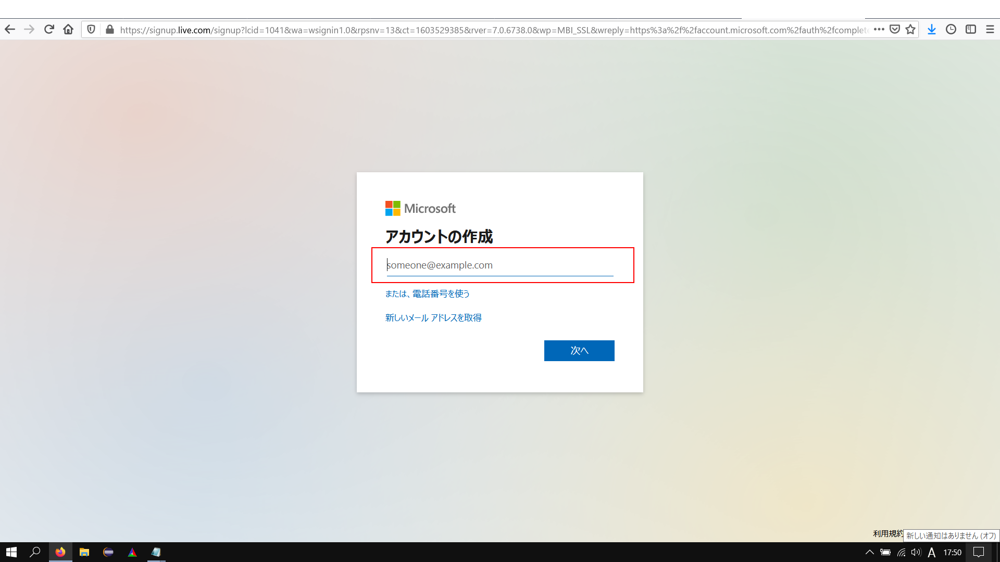

# Let's start Microsoft Teams !

( Oops!, this article is written in Japanese. )

マイクロソフトが提供しているファイル共有，テレビ会議などができる
コラボレーションアプリである"Teams"の始め方とつまづきやすいポイント，
しておくとよい設定項目とかを書いていきます．

 

## 目次

1. Microsoftアカウントを作ろう
2. Teamsをインストールしよう
3. しておくとよい設定項目
4. Zoomとの違い

 

## 1. Microsoftアカウントを作る

まず，マイクロソフトアカウントを作る必要があります．

**既にマイクロソフトアカウントを持っている方もいるかもしれませんが,ここで注意！！**

- 大学のメールアドレスでサインインはできますが，管理者は大学のため
自由にファイル共有をしたり，テレビ会議をしたりできない場合があります．

- 一部のGmailでは登録できない場合があります．その場合は携帯メールアドレスや
Yahooメールアドレス，Outlookメールアドレスを作成して登録してみてください．

 

今回は自分の個人用のGmailを使用して新規にアカウントを作成します．

マイクロソフトの[アカウントページ](https://account.microsoft.com/account/Account?ru=https%3A%2F%2Faccount.microsoft.com%2F&destrt=home-index)を開きます

 

"Microsoftアカウントを作成"をクリック

 

次の自分のメールアドレスを入力します．

 

アカウントのパスワードを設定します．

 

最後に登録したメールアドレスへ認証用の数字列が送信されるので，
その数字を入力して，アカウント作成完了です．

 

このような画面が出れば成功です．
次はTeamsをインストールしてみましょう．

 

## 2. Teamsをインストールしよう

Teamsの[ホームページ](https://www.microsoft.com/ja-jp/microsoft-365/microsoft-teams/group-chat-software)を開きます．

"無料でサインアップ"をクリック

 

先ほど作ったマイクロソフトアカウントで使用したのと同じメールアドレスを入力します．

 

ここで"Teamsをどのように使用しますか？"と聞かれます．
ここがひっかけ問題です．

**必ず，"仕事と組織向け"を選択してください**

 

ここでの他の選択肢は

- 学校向け → 有料のサブスクリプションサービスである"Office365"の登録が必要に
- 友人や家族向け　→ Teamsではなく別サービスである"Skype"のページに飛ばされる

といったようにTeamsを使うには仮想の会社を自分で設定する必要があります．

後ほど，きちんとした会社や組織に所属した場合は組織からもらったメールアドレスで
Teamsに新しく登録することが可能です．

ここでは，自分一人だけの仮想の会社を後ほど設定します．

 

選択したら，マイクロソフトアカウントのパスワードを入力します．

 

名前のフルネームと仮想の会社名を入力します．
会社名はご自身の自由で構いません（実在の会社は避けたほうが無難かもしれません）

入力が終わった"Teamsのセットアップ"を押します．

 

しばらくセットアップの時間がかかります．
Teamsを使用する方法として2つの選択肢があります．
ここでは，"Teamsアプリ"をお勧めします．

Webアプリでもテレビ会議などの機能はあるのですが，
使えない機能などもあるのでTeamsアプリをダウンロード，インストールするのがおすすめです．

1.
2.

# Hello_world_miki_san

# The largest heading (最大のヘッディング)
## The second largest heading (2番目に大きなヘッディング)

**これは太字のテキストです**

このサイトは [GitHub Pages](https://pages.github.com/) を使って構築されています。

- George Washington
- John Adams
- Thomas Jefferson

1. James Madison
2. James Monroe
3. John Quincy Adams

